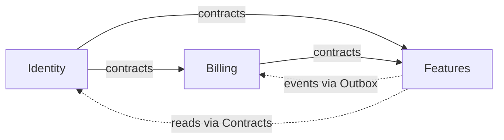
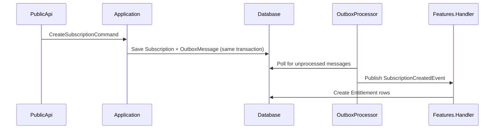

# MySaaS

A modular monolith SaaS template built on .NET 10, demonstrating clean architecture principles with automated architecture enforcement.

## Architecture Overview

This project is a **modular monolith** — a single deployable unit composed of self-contained modules, each following **Clean Architecture** with strict layer separation. Modules communicate through well-defined contracts and asynchronous events, not direct references.

### Module Dependency Graph



Modules only reference each other's `*.Contracts` assemblies. Domain, Infrastructure, and Application layers are never shared.

### Layer Flow

Each module follows a unidirectional dependency flow:

```
Domain (entities, no dependencies)
    ↓
Application (commands, queries, handlers, repository interfaces)
    ↓
Infrastructure (EF Core DbContext, repository implementations)
    ↓
PublicApi (ASP.NET Core controllers, composition root)
```

This flow is enforced by `LayerDependencyTests` in the test suite.

### Event Flow (Outbox Pattern)

Cross-module communication uses MediatR in-process events published through an outbox pattern for reliability:



## Project Structure

```
MySaaS/
├── src/
│   ├── BuildingBlocks/
│   │   └── MySaaS.BuildingBlocks/     # Shared base types (Entity<TId>, IModule)
│   ├── Identity/                       # Authentication, users, roles
│   │   ├── Identity.Domain/            # Entities: User, Role, UserRole
│   │   ├── Identity.Application/       # Handlers, service interfaces
│   │   ├── Identity.Infrastructure/    # EF Core, IdentityService
│   │   ├── Identity.Contracts/         # IIdentityService, UserResult
│   │   └── Identity.PublicApi/         # ASP.NET Core host, controllers
│   ├── Billing/                        # Subscriptions, plans, invoicing
│   │   ├── Billing.Domain/             # Entities: Subscription, Plan, Invoice
│   │   ├── Billing.Application/        # Commands/queries, Outbox publisher
│   │   ├── Billing.Infrastructure/     # EF Core, repositories, OutboxProcessor
│   │   ├── Billing.Contracts/          # SubscriptionCreatedEvent
│   │   └── Billing.PublicApi/          # Controllers
│   └── Features/                       # Feature flags, entitlements
│       ├── Features.Domain/            # Entities: Entitlement, FeatureFlag, Rollout
│       ├── Features.Application/       # Event handlers (SubscriptionCreatedHandler)
│       ├── Features.Infrastructure/    # EF Core, repositories
│       ├── Features.Contracts/         # Contracts (placeholder)
│       └── Features.PublicApi/         # Controllers
├── tests/
│   └── ArchitectureTests/              # Automated architecture enforcement
├── .github/workflows/
│   └── build.yml                       # CI pipeline
└── MySaaS.slnx                         # Solution file (XML format)
```

### Module Boundaries

Each module exposes only a `*.Contracts` assembly containing interfaces and DTOs — no domain entities, no EF Core dependencies. This is the sole seam through which modules interact.

| Module | Schema | Depends On |
|---|---|---|
| Identity | `identity` | None (independent) |
| Billing | `billing` | Identity.Contracts |
| Features | `features` | Billing.Contracts |

## Prerequisites

- [.NET 10 SDK](https://dotnet.microsoft.com/download/dotnet/10.0)
- [PostgreSQL](https://www.postgresql.org/) (running locally or in Docker)

## Getting Started

1. **Clone the repository:**

   ```bash
   git clone https://github.com/<your-org>/MySaaS.git
   cd MySaaS
   ```

2. **Configure the connection string:**

   Update `appsettings.json` in the `Identity.PublicApi` project with your PostgreSQL connection string:

   ```json
   {
     "ConnectionStrings": {
       "DefaultConnection": "Host=localhost;Database=mysaas;Username=postgres;Password=<your-password>"
     }
   }
   ```

   All modules share a single connection string but use separate schemas.

3. **Apply migrations:**

   ```bash
   dotnet ef database update --project src/Identity/Identity.Infrastructure --startup-project src/Identity/Identity.PublicApi
   dotnet ef database update --project src/Billing/Billing.Infrastructure --startup-project src/Identity/Identity.PublicApi
   dotnet ef database update --project src/Features/Features.Infrastructure --startup-project src/Identity/Identity.PublicApi
   ```

4. **Run the application:**

   ```bash
   dotnet run --project src/Identity/Identity.PublicApi
   ```

   The Identity.PublicApi is the composition root — it registers all modules.

## Running Tests

**All tests:**

```bash
dotnet test
```

**Architecture tests only:**

```bash
dotnet test tests/ArchitectureTests
```

The architecture test suite enforces:

| Test | Rule |
|---|---|
| `NamingTests` | Handlers end with `Handler`, entities live in `Entities` namespaces |
| `CqrsSeparationTests` | Commands and Queries namespaces are independent |
| `ContractsPurityTests` | Contracts have no EF Core or Domain dependencies |
| `LayerDependencyTests` | Domain ← Application ← Infrastructure ← PublicApi (unidirectional) |
| `ModuleBoundaryTests` | Modules only reference each other through Contracts |

## Module Communication

### Cross-Module Reads

Modules read from other modules through contract interfaces, never through direct domain or infrastructure references:

```csharp
// Billing.Application references Identity.Contracts, not Identity.Domain
public class CreateSubscriptionCommandHandler(IIdentityService identityService)
{
    var user = await identityService.GetUserByIdAsync(command.UserId);
    // ...
}
```

### Cross-Module Writes (Events)

Modules publish domain events through the outbox pattern:

1. **Event definition** — Defined in `*.Contracts` (e.g., `SubscriptionCreatedEvent`).
2. **Outbox write** — The handler serializes the event into an `OutboxMessage` table within the same database transaction as the business write.
3. **Outbox processing** — A background service (`OutboxProcessor`) polls unprocessed messages every 5 seconds and publishes them via MediatR.
4. **Event handling** — The consuming module's handler reacts (e.g., `SubscriptionCreatedHandler` creates entitlements).

This guarantees at-least-once delivery without distributed transactions.

## CI/CD

The GitHub Actions workflow (`.github/workflows/build.yml`) runs on push to `main` or PRs targeting `main`:

1. Checkout code
2. Setup .NET 10
3. Restore dependencies
4. Build the solution
5. Run architecture tests (with dedicated TRX output)
6. Run all tests

## Contributing

### Adding a New Module

1. Create a new folder under `src/` with the standard layer structure:
   - `*.Domain` — Entities inheriting `Entity<TId>`
   - `*.Application` — Commands, queries, handlers, repository interfaces
   - `*.Infrastructure` — EF Core DbContext, repository implementations
   - `*.Contracts` — Interfaces and DTOs only (no Domain/EF Core references)
   - `*.PublicApi` — ASP.NET Core controllers and `Program.cs`

2. Register the module via an extension method (e.g., `AddYourModule(IServiceCollection)`).

3. Add the module's projects to `MySaaS.slnx`.

4. Add architecture tests in `tests/ArchitectureTests/` to enforce boundaries.

### Architecture Rules

- **Unidirectional dependencies**: Domain → Application → Infrastructure → PublicApi. Never reverse.
- **Contract purity**: Contracts must not reference `EntityFrameworkCore` or any `*.Domain` assembly.
- **Module isolation**: Modules communicate only through `*.Contracts` assemblies or MediatR events published via the outbox.
- **CQRS separation**: Commands and queries must be in separate namespaces.
- **Naming**: Handlers end with `Handler`. Domain entities live in `Entities` namespaces.

### Database

Each module uses its own EF Core `DbContext` and PostgreSQL schema, but shares a single connection string. When adding a new module:

1. Create a `DbContext` in the Infrastructure layer.
2. Add a EF Core migration targeting the new schema.
3. Ensure the `OutboxMessage` table exists if the module publishes events.
